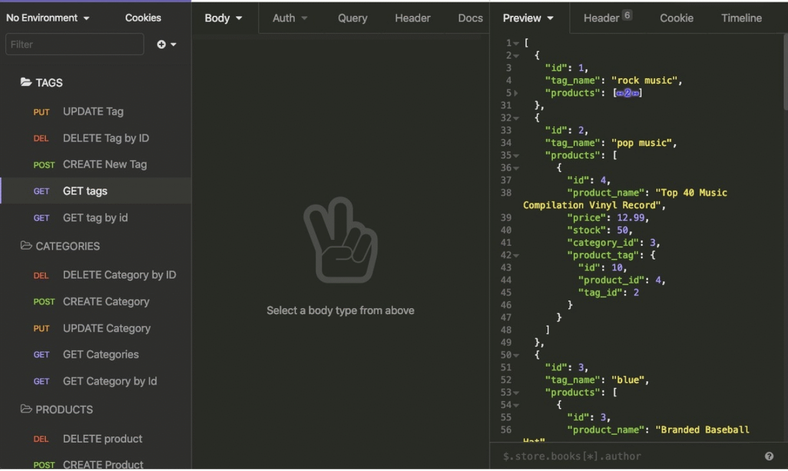
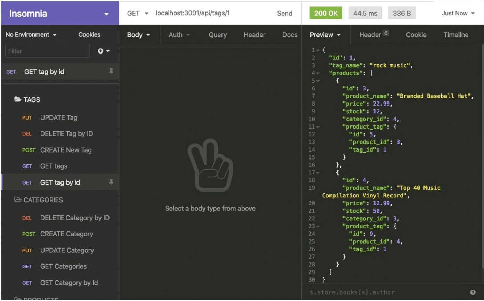

# E-commernce-Back-End

## Description
This ecommernce project was built to keep track of products and ids through mysql.
The project uses sequelize, mysql and dotenv.

## Usage
Clone the repo and run these commands in the terminal
-npm i
-npm i mysql
-npm i dotenv
-npm i sequelize

In schema.sql log into your mysql
-source schema.sql
-exit

In the terminal
-npm run seed
-npm start

## ScreenShots

## License
MIT License